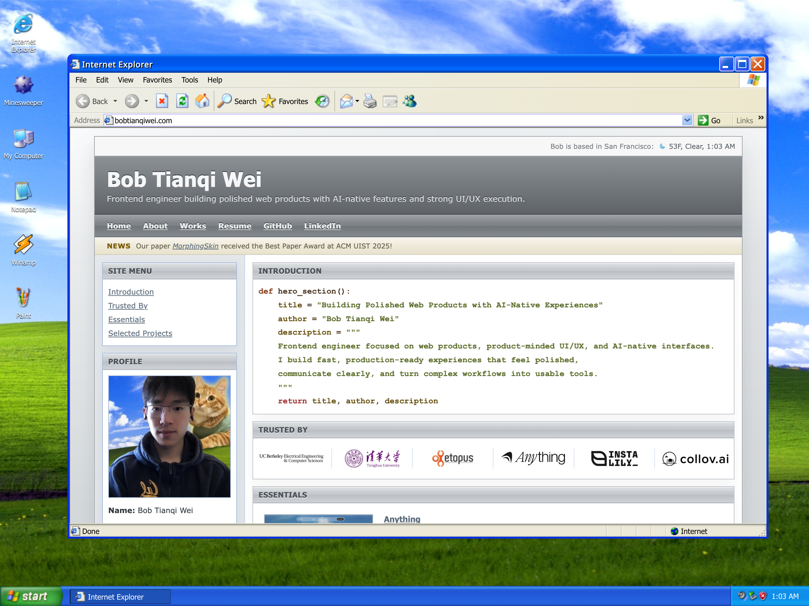

# Retroframe


Retroframe is a retro Web 2.0 style academic personal website template for researchers, professors, and technical builders.

It is designed for people who want a structured, publication-ready homepage that feels distinctive and content-focused, rather than a generic modern landing page.

Free to use and modify. Attribution in the footer is highly appreciated but not required.

## Structure

- `content/site.js`: site-wide copy, profile data, links, ticker items, and partner logos
- `content/projects/*.js`: one file per project or publication
- `content/projects/_template.js`: starter file for a new project
- `scripts/build.js`: generates the static site
- `assets/`: shared CSS, JavaScript, and images
- `index.html` and `projects/*/index.html`: generated output

## Quick Start

```bash
npm install
npm run build
npm run preview
```

Then open [http://localhost:8888](http://localhost:8888).

## Editing Content

Most edits happen in:

- `content/site.js`
- `content/projects/*.js`

This template also works well with coding tools such as Claude Code, Codex, and Cursor. You can ask them to replace the demo content with your own projects, publications, links, and profile information very quickly.

Then rebuild:

```bash
npm run build
```

## What Is Included

- A retro-style homepage with sidebar profile, logo strip, featured work, and a ticker
- Project detail pages with a consistent side column
- A gallery slider for media-heavy projects
- A clean relative-link build system so the output can be hosted as static files
- A demo setup aimed at researchers and engineers, including projects and publications

## Demo Assets

- The demo profile photo and work images use free photos from Unsplash. Replace them with your own images before publishing if you want a fully personal site.
- The "Trusted By" logo strip uses major tech company logos as demo placeholders. Those brands are not affiliations unless you actually add them for your own site.

## Deploy On GitHub Pages For Free

This template builds to plain static files, so it can be hosted on GitHub Pages without a server.

1. Fork this repository into your own GitHub account.
2. Rename the forked repository to `<username>.github.io`.
3. Run `npm install` and `npm run build`.
4. Commit the generated `index.html`, `projects/`, `publications/`, `about/`, and `assets/` output.
5. Push the changes to your fork.
6. On GitHub, open `Settings` -> `Pages`.
7. Choose your publishing source:
   Use `Deploy from a branch` if you want to publish the built files directly from `main` or `gh-pages`.
   Use a custom GitHub Actions workflow if you want GitHub to run the build for you.
8. If you publish from a branch and do not want Jekyll processing, add an empty `.nojekyll` file in the publishing root.
9. Wait for the Pages deployment to finish, then open your `https://<username>.github.io` site.

Notes:

- For a user or organization site, the repository name should be `<username>.github.io`.
- For a project site, the URL is usually `https://<username>.github.io/<repository>/`.
- If your repository is public, GitHub Pages hosting is free.

## Use A Purchased Domain

You can connect a custom domain you bought from Namecheap, Cloudflare, Squarespace Domains, GoDaddy, or another DNS provider.

1. Publish the site on GitHub Pages first and confirm the default `github.io` URL works.
2. In GitHub, open `Settings` -> `Pages`, enter your custom domain, and save.
3. In your domain provider DNS settings, add the records GitHub Pages expects.

For an apex domain such as `example.com`:

- Add `A` records pointing to `185.199.108.153`
- Add `A` records pointing to `185.199.109.153`
- Add `A` records pointing to `185.199.110.153`
- Add `A` records pointing to `185.199.111.153`
- Optionally add the four `AAAA` records from GitHub Docs if you want IPv6 support

For a subdomain such as `www.example.com`:

- Add a `CNAME` record from `www` to your default Pages host, such as `<username>.github.io`

Recommended setup:

- Use `www.example.com` as the main custom domain because GitHub Docs describes `www` as the most stable option
- Also configure the apex domain so GitHub can redirect `example.com` to `www.example.com`
- Verify the domain in GitHub to reduce takeover risk
- Wait for DNS propagation, which GitHub Docs says can take up to 24 hours

## Suggested Publish Flow

If you want the simplest setup, use this workflow:

1. Edit `content/site.js` and `content/projects/*.js`
2. Run `npm run build`
3. Push the generated static files to GitHub
4. Turn on GitHub Pages
5. Add a custom domain later if you need it

## Development

```bash
npm run build
npm run preview
```

`preview` runs on port `8888`.

## References

- [Creating a GitHub Pages site](https://docs.github.com/en/enterprise-cloud@latest/pages/getting-started-with-github-pages/creating-a-github-pages-site)
- [Managing a custom domain for your GitHub Pages site](https://docs.github.com/en/pages/configuring-a-custom-domain-for-your-github-pages-site/managing-a-custom-domain-for-your-github-pages-site?platform=linux)
- [About custom domains and GitHub Pages](https://docs.github.com/en/pages/configuring-a-custom-domain-for-your-github-pages-site/about-custom-domains-and-github-pages?apiVersion=2022-11-28)
- [Verifying your custom domain for GitHub Pages](https://docs.github.com/en/pages/configuring-a-custom-domain-for-your-github-pages-site/verifying-your-custom-domain-for-github-pages?apiVersion=2022-11-28)

## License

MIT

