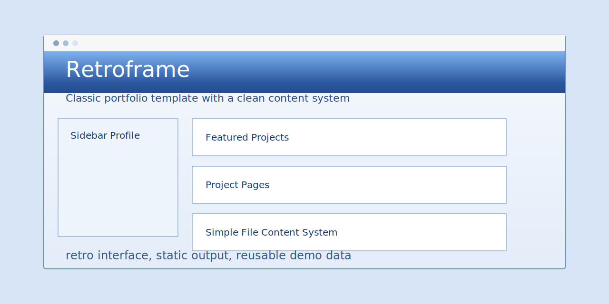

# Retroframe



Retroframe is a standalone classic portfolio template with a retro web interface and a simple file-based content system.

It is built for people who want a portfolio site that feels more distinctive than a typical modern landing page, while still staying easy to edit and deploy.

## Structure

- `content/site.js`: site-wide copy, profile data, links, ticker items, and partner logos
- `content/projects/*.js`: one file per project
- `content/projects/_template.js`: starter file for a new project
- `scripts/build.js`: generates the static site
- `assets/`: shared CSS, JavaScript, and images
- `index.html` and `projects/*/index.html`: generated output

## Quick Start

```bash
npm install
npm run build
npm run preview
```

Then open [http://localhost:8888](http://localhost:8888).

## Editing Content

Most edits happen in:

- `content/site.js`
- `content/projects/*.js`

Then rebuild:

```bash
npm run build
```

## What Is Included

- A retro-style homepage with sidebar profile, logo strip, featured work, and a ticker
- Project detail pages with a consistent side column
- A gallery slider for media-heavy projects
- A clean relative-link build system so the output can be hosted as static files
- A generated demo setup that is already decoupled from Bob's personal site data

## Development

```bash
npm run build
npm run preview
```

`preview` runs on port `8888`.

## License

MIT
